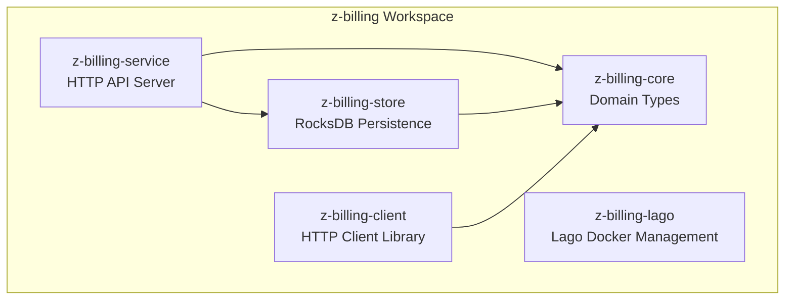

# Z-Billing

A credit-based billing system for the Cypher Ecosystem and Zero Tech that handles usage tracking, subscription management, and payment processing. Users purchase and spend Z Credits for LLM inference, compute resources, and API calls.

## Features

- Z Credit system (1 credit = $0.01)
- Account and balance management
- Subscription plans (Free, Standard, Pro, Enterprise)
- Usage-based billing (LLM tokens, compute, API calls)
- Stripe integration for payments
- Lago integration for analytics
- Auto-refill functionality
- Service-to-service API for usage reporting

## Architecture



| Crate | Description |
|-------|-------------|
| `z-billing-core` | Domain types (no I/O) |
| `z-billing-store` | RocksDB persistence with `Store` trait |
| `z-billing-service` | Axum HTTP API server |
| `z-billing-client` | HTTP client library for consumers |
| `z-billing-lago` | Lago deployment via Docker Compose |

## Core Concepts

### Z Credits

- 1 Z Credit = $0.01 (1 cent)
- Example: $50 purchase = 5,000 credits
- Stored as `i64` integers to avoid floating-point issues

### Accounts

- Balance tracking (current + lifetime stats)
- Optional subscription with monthly grants
- Auto-refill configuration
- Stripe and Lago customer IDs

### Subscription Plans

| Plan | Monthly Price | Monthly Credits | Purchase Discount |
|------|---------------|-----------------|-------------------|
| Free | $0 | 0 | 0% |
| Standard | $20 | 2,500 | 10% |
| Pro | $50 | 6,000 | 20% |
| Enterprise | Custom | Custom | Custom |

### Transaction Types

- `Purchase` - User purchased credits
- `Usage` - Credits deducted for usage
- `SubscriptionGrant` - Monthly subscription credit grant
- `Refund` - Refund issued
- `Bonus` - Promotional/bonus credits
- `AutoRefill` - Automatic refill triggered

## Getting Started

### Prerequisites

- Rust 2021 edition (1.70+)
- RocksDB (installed via system package or bundled)
- Docker (optional, for Lago deployment)

### Build

```bash
cargo build --release
```

### Run

```bash
# Set required environment variables
export DATA_DIR=./data
export SERVICE_API_KEY=your-secret-key

# Run the service
cargo run --release -p z-billing-service
```

Server starts on `http://0.0.0.0:8080` by default.

## Configuration

### Environment Variables

| Variable | Default | Description |
|----------|---------|-------------|
| `LISTEN_ADDR` | `0.0.0.0:8080` | HTTP server bind address |
| `DATA_DIR` | `/data/z-billing` | RocksDB data directory |
| `AUTH_BASE_URL` | `https://zid.zero.tech` | ZID JWKS endpoint |
| `AUTH_AUDIENCE` | `z-billing` | Expected JWT audience |
| `SERVICE_API_KEY` | - | Service-to-service auth key |
| `STRIPE_API_KEY` | - | Stripe secret key |
| `STRIPE_WEBHOOK_SECRET` | - | Stripe webhook signing secret |
| `LAGO_API_URL` | - | Lago API endpoint |
| `LAGO_API_KEY` | - | Lago API authentication key |
| `LAGO_ORGANIZATION_ID` | - | Lago organization ID |
| `FRONTEND_URL` | `http://localhost:3000` | Checkout redirect URL |
| `CORS_ORIGINS` | `*` | Comma-separated allowed origins |
| `MAX_BODY_BYTES` | `1048576` | Maximum request body size (1MB) |
| `REQUEST_TIMEOUT_SECONDS` | `30` | Request timeout |

### Secrets Files (alternative)

Configuration can also be loaded from JSON files in `.secrets/`:

- `.secrets/stripe.json`
  ```json
  {
    "api_key": "sk_...",
    "webhook_secret": "whsec_..."
  }
  ```

- `.secrets/lago.json`
  ```json
  {
    "api_url": "https://api.getlago.com",
    "api_key": "...",
    "organization_id": "..."
  }
  ```

## API Overview

| Method | Path | Auth | Description |
|--------|------|------|-------------|
| GET | `/health` | None | Health check |
| POST | `/v1/accounts` | ZID JWT | Create account |
| GET | `/v1/accounts/me` | ZID JWT | Get account |
| DELETE | `/v1/accounts/me` | ZID JWT | Delete account |
| GET | `/v1/credits/balance` | ZID JWT | Get balance |
| GET | `/v1/credits/transactions` | ZID JWT | Transaction history |
| POST | `/v1/credits/purchase` | ZID JWT | Initiate Stripe checkout |
| POST | `/v1/credits/auto-refill` | ZID JWT | Configure auto-refill |
| POST | `/v1/credits/add` | Admin | Add credits (admin) |
| GET | `/v1/payments` | ZID JWT | List payment history |
| POST | `/v1/usage` | Service Key | Report usage event |
| POST | `/v1/usage/batch` | Service Key | Report multiple events |
| POST | `/v1/usage/check` | Service Key | Check balance sufficiency |
| POST | `/webhooks/stripe` | Stripe Sig | Handle Stripe events |
| POST | `/webhooks/lago` | Lago Sig | Handle Lago events |

## Authentication

### End-User (ZID JWT)

```
Authorization: Bearer <jwt>
```

- JWT validated via JWKS from Zero-ID
- User ID extracted from `sub` claim

### Service-to-Service (API Key)

```
X-API-Key: <service_api_key>
X-Service-Name: aura-runtime
```

- Used by internal services (aura-runtime, aura-swarm)
- Reports usage events on behalf of users

### Test Token (development)

```
Authorization: Bearer test-token:<user-uuid>
```

## Integrations

### Stripe

- Customer management
- Checkout sessions for credit purchases
- Webhook handling for payment events
- Auto-refill charges

### Lago

- Usage event forwarding for analytics
- Subscription lifecycle management
- Invoice generation

## Storage

- Uses RocksDB for persistence
- Column families: `accounts`, `transactions`, `transactions_by_user`, `usage_events`
- CBOR serialization for compact storage
- Atomic operations for balance consistency

## Development

### Run Tests

```bash
cargo test
```

### With Integration Tests

```bash
# Requires Stripe/Lago test credentials
cargo test --features integration
```

### Logging

```bash
RUST_LOG=debug cargo run -p z-billing-service
```

## License

MIT License
